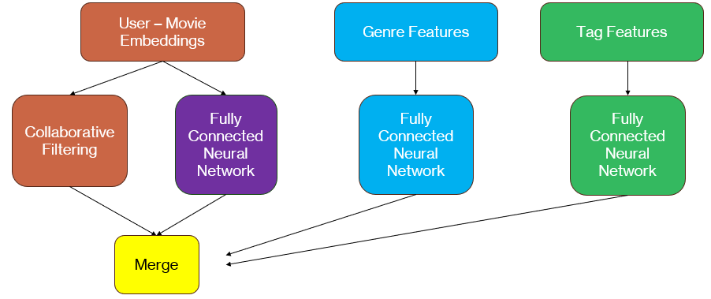

Hybrid Collaboritve and Content Based Neurel Network Recommender System 
===============================

Welcome to my final project: the culmination of my experience with lighthouse labs data science bootcamp.   

For my final project I wanted to create a recommender system.  I love movies and I was always very curious how the streaming services created their recommender systems. I also wanted to take the final project as an opportunity to better understand nerual networks.  With the rise of transformers in the world of data science and model creation, creating a neural network model of my own would be a good step in working towards a holistic understanding of how these things work and using them in the future.   

...and my hybrid collaborative and content based filtering neural network recommender system model was born.

My final project code can be seen in the FINAL-PROJECT.ipynb file. The FINAL-PROJECT file is where my model was developed and all the work that I want to display in it's creation is displayed.   

There are 2 other notebooks included in the notebooks folder: big-data-testing.ipynb and hyperparameter-tuning.ipynb.  These are notebooks that I ran in google collab to utilize GPU computing power and faster run times.  The big-data-testing file was ran with larger amounts of data from the movielens data set.  That version of the model offers significantly more films, userIds and user ratings.   The hyperparameter-tuning file was run to optimize my models parameters with smaller chunks of the dataset than big-data-testing.

Proejct Workflow:
===================

Exploratory Data Analysis (EDA):
---------------------------------

The first step of the project is understanding the dataset.  For my recommender I chose the MovieLens data set. The MovieLens dataset is a widely recognized and extensively used dataset. It contains 27,753,444 ratings and 1,108,997 tag applications across 58,098 movies. These data were created by 283,228 users between January 09, 1995 and September 26, 2018. This dataset was generated on September 26, 2018.

The data are contained in the files `genome-scores.csv`, `genome-tags.csv`, `links.csv`, `movies.csv`, `ratings.csv` and `tags.csv`. The features I used for my model were the movies, ratings and tags data files.

Movie information is contained in the file `movies.csv`. Each line of this file after the header row represents one movie, and has the following format:

    movieId,title,genres

All ratings are contained in the file `ratings.csv`. Each line of this file after the header row represents one rating of one movie by one user, and has the following format:

    userId,movieId,rating,timestamp

The lines within this file are ordered first by userId, then, within user, by movieId.

Ratings are made on a 5-star scale, with half-star increments.

All tags are contained in the file `tags.csv`. Each line of this file after the header row represents one tag applied to one movie by one user, and has the following format:

    userId,movieId,tag,timestamp

The lines within this file are ordered first by userId, then, within user, by movieId.

Tags are user-generated metadata about movies. Each tag is typically a single word or short phrase. The meaning, value, and purpose of a particular tag is determined by each user.

Data Preprocessing:
------------------------------

### `ratings.csv`

To preprocess the user ratings data I made sure there was no missing data and I normalized the rating between 0 and 1.  I removed the timestamp from the dataset as it wasn't a useful input for my model.

### `tags.csv`

It was hard to know which tags would provide useful information to my model and which would be completely irrelelvant.   If a user gave an extremely obscure tag that no other movie had, it would be 'garbage' information to my model. To mitigate this I removed any tags from the tag data frame that occured less that 200 times.  From there I aggregated all the tags into lists by movieId. To get rid of duplicate tags for the same move, I turned the aggregated lists into sets and then back into lists.   For input to my model the tags were one hot encoded per movie via sklearn's multi label binarizer.

### `movies.csv`

For the movies dataframe I used the genre information as model input.  I used sklearn multi label binarizer to create one-hot encoded genres for each movie as a model input.

### Assembling Data

Now that the data was preprocessed, it was assembled into the movielens_df, which would be the input to the model.   The movielens_df dataframe is a combination of the ratings dataframe with genre and tag features attached.   The dataframe has 100,000 ratings, the userId who rated the movie, the movieId for the rating, and the genre and tag features associated with that movie.

Model Selection:
-----------------------------------

For my model I wanted to leverage content based filtering, using the information from different movies characteristics (like genres and tags) to suggest similar movies and collaboaraitve filtering, recommending movies to users based on the similar interests of other users. 

The model combines collaborative filtering, neural network-based recommendations, and content-based features to predict ratings for user-movie pairs. The collaborative filtering component captures user-movie interactions through matrix factorization, while the neural network and content-based components capture additional features to enhance the recommendation predictions.

### Model Architecture

Here we can see the architecture of the recommender system. Collaborative filtering focuses on the user-movie interactions, learning from the preferences of similar users to make recommendations.  The neural network components of the system consists of multiple layers that process user and movie embeddings, as well as genre and tag features. 

### User-Movie Model Components

An embedding size of 50 is chosen for the size of the embedding vectors for users and movies. It determines the dimensionality of the learned representations. UserId and MovieId data are the inputs to this section of the model. Both inputs are in the shape (1,), indicating a single ID is fed to the model at a time. 

The userId and movieId are both made into embedding layers, where the information is mapped to dense representation vectors of size embedding_size.  The embedding layers are then reshaped to a flat shape of (50,).   To capture the relationship between users and the movies we take the dot product of the reshaped movie and user embeddings.  

Similar to the collaboriatve filtering side, the inputs (userId and movieId) are turned into two different embedding layers of size 50 and then reshaped to a flat shape. The vectors are concatenated and fed to a fully connected dense layer that applies a ReLU activation. It reduces the dimensionality of the concatenated embeddings to embedding_size/2.

### Genre and Tag Features

This section of the model captures the content based aspects of the hybrid recommender model.   The genre input are one-hot encoded vectors of a movie's genres and the tag input are one-hot encoded vectors of a movie's tags. The tags and the genres are both fed into their own fully connected dense layers and undergo ReLU activations.  The respective nueral nets capture relevant features unqiue to each movie.

### Merging 

Now we bring the whole model together. All the previous outputs, including the collaborative filtering dot product, neural network dense layer, genre features, and tag features, are concatenated together. A fully connected dense layer takes the concatenated features as input and applies a linear activation. It outputs the predicted ratings for user-movie pairs.

Model Training and Evaluation:
------------------------------------------

Before going into the model the data was divided by a 80 / 20 test train split. The final model takes user ID, movie ID, genre input, and tag input as inputs and outputs the predicted ratings of films.  For traiing the model I specified the loss function as Mean Squared Error (MSE) and the optimizer as Adam.

The root mean square error was used to evaluate the predicted movie ratings to the test ratings.  The lowest RMSE calculated was 0.21.  The movie recommendation predicted rating went slightly above 5 and slightly below 0.  Those ratings were clipped at 5.0 and 0.0 respectively.  When the ratings were clipped the RMSE improved by 0.0005.

To optimize the model, I tested different combinations of hyperparameters and training components. Different values for 'embedding_size', 'batch_size' and 'epochs' were tested using a nested loop. For each combination, a hybrid model is created and the model is trained on the training data with the specified number of epochs and batch size. After training, the model's performance is evaluated using the MSE.

Once the model was trained and tuned I wrote code to recommend the highest rated films that a user hadn't yet seen. It is difficult to evaluate how well a recommender model worked since movie taste is a such a subjective thing; however, when comparing a users favorite films to the top 3 films recommended, I think it provided movie recommendations that were alinged with movie viewer interests and viewing patterns.  

Future Developments:
-----------------------------------------

Neural Net Optimizing:
I would like to continue optimizing my model for better performance.   Nexts steps are to experiment with baysian optimization and adding additional movie features from the imdb api. The `links.csv` file offers imdbIds for all movies in their dataset for ease of use with the imdb api.

API Development:
I would like to take the optimized trained model and develop an API that takes the user_id as input and returns 3 recommended movies. 

Deployment:
Finally, I would like to deploy the API onto AWS cloud platform to enable users to access the recommender engine through a web or mobile interface.